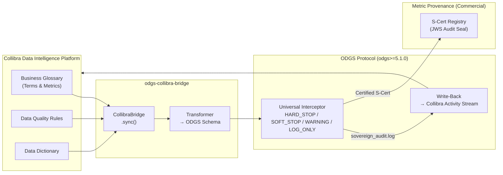

# ODGS Collibra Bridge

[](https://opensource.org/licenses/Apache-2.0)
[](https://github.com/MetricProvenance/odgs-protocol)
[](https://pypi.org/project/odgs-collibra-bridge/)
[](https://pypi.org/project/odgs-collibra-bridge/)

**Transform your Collibra Business Glossary into active ODGS runtime enforcement schemas.**

> Collibra documents your data. ODGS enforces it.

The ODGS Collibra Bridge is an **institutional connector** that translates Collibra Business Glossary assets — terms, metrics, and data quality rules — into cryptographically addressable ODGS enforcement schemas. It bridges the gap between passive data cataloguing and active regulatory enforcement, making Collibra governance decisions mechanically executable at pipeline runtime.

Architecturally aligned with **CEN/CENELEC JTC 25** and **NEN 381 525** federated data sovereignty principles.

---

## Architecture



---

## Install

```bash
pip install odgs-collibra-bridge
```

---

## Quick Start

### Python API

```python
from odgs_collibra import CollibraBridge

bridge = CollibraBridge(
    base_url="https://your-org.collibra.com",
    api_token="your-api-token",
    organization="acme_corp",
)

# Sync Finance community → ODGS metric schemas
bridge.sync(
    community="Finance",
    output_dir="./schemas/custom/",
    output_type="metrics",
)

# Sync DQ rules → ODGS enforcement rules (HARD_STOP on violation)
bridge.sync(
    community="Data Quality",
    output_dir="./schemas/custom/",
    output_type="rules",
    severity="HARD_STOP",
)
```

### CLI

```bash
# Sync using API token
odgs-collibra sync \
    --url https://your-org.collibra.com \
    --token YOUR_API_TOKEN \
    --org acme_corp \
    --community "Finance" \
    --output ./schemas/custom/ \
    --type metrics

# Push compliance results back to Collibra activity stream
odgs-collibra write-back \
    --log-path ./sovereign_audit.log \
    --url https://your-org.collibra.com \
    --token YOUR_API_TOKEN
```

### Output Schema

```json
{
  "$schema": "https://metricprovenance.com/schemas/odgs/v5",
  "metadata": {
    "source": "collibra",
    "organization": "acme_corp",
    "bridge": "odgs-collibra-bridge",
    "asset_count": 42
  },
  "items": [
    {
      "rule_urn": "urn:odgs:custom:acme_corp:net_revenue",
      "name": "Net Revenue",
      "severity": "HARD_STOP",
      "logic": { "formula": "gross_revenue - returns" },
      "plain_english_description": "Net revenue must equal gross revenue minus returns",
      "content_hash": "a1b2c3..."
    }
  ]
}
```

---

## Bi-Directional Write-Backs

The bridge supports **Bi-Directional Sync**: it parses your `sovereign_audit.log` offline and pushes compliance results back into the corresponding Collibra Asset's activity stream — creating a seamless feedback loop for Governance Officers without compromising the air-gapped nature of the core ODGS protocol.

```bash
odgs-collibra write-back \
    --log-path ./sovereign_audit.log \
    --url https://your-org.collibra.com \
    --token YOUR_API_TOKEN
```

---

## Authentication

| Method | Flag | Environment Variable |
|---|---|---|
| API Token (recommended) | `--token` | `COLLIBRA_API_TOKEN` |
| Basic Auth | `--username` + `--password` | — |

---

## Regulatory Alignment

This bridge is designed for organisations governed by:

| Regulation | Relevance |
|---|---|
| **EU AI Act (2024/1689) Articles 10 & 12** | Data governance & audit trail requirements for High-Risk AI Systems |
| **DORA (Regulation EU 2022/2554)** | ICT operational resilience — data lineage and incident traceability |
| **GDPR Article 5(2)** | Accountability principle — demonstrable data governance |
| **NEN 381 525** | Dutch federated data sovereignty standard |

> For cryptographic legal indemnity (Ed25519 JWS audit seals, certified Sovereign Packs for DORA/EU AI Act), see the **[Metric Provenance Enterprise Platform](https://platform.metricprovenance.com)**.

---

## Requirements

- Python ≥ 3.9
- `odgs` ≥ 5.1.0 (core protocol — v6.0 compatible)
- Collibra Data Intelligence Platform (any version with REST API v2)

---

## Related

- [ODGS Protocol](https://github.com/MetricProvenance/odgs-protocol) — The core enforcement engine
- [ODGS FLINT Bridge](https://github.com/MetricProvenance/odgs-flint-bridge) — TNO FLINT legal ontology connector
- [ODGS Databricks Bridge](https://github.com/MetricProvenance/odgs-databricks-bridge) — Unity Catalog integration
- [ODGS Snowflake Bridge](https://github.com/MetricProvenance/odgs-snowflake-bridge) — Snowflake integration

---

## License

Apache 2.0 — [Metric Provenance](https://metricprovenance.com) | The Hague, NL 🇳🇱
